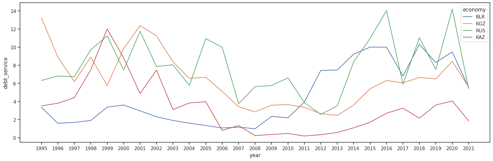
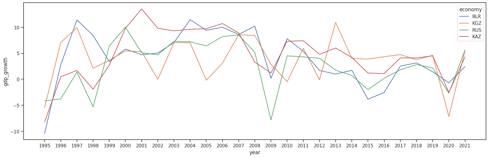
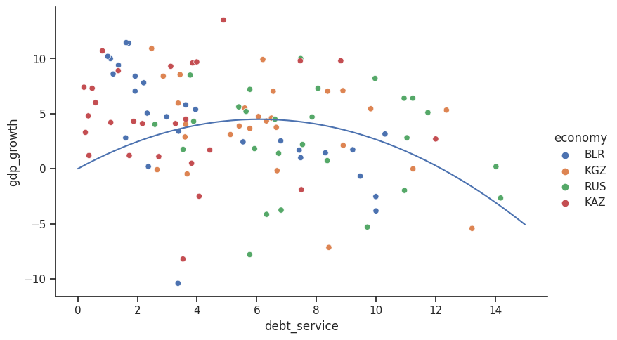
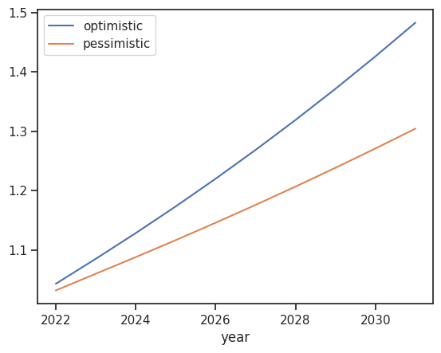

# Debt and Growth

## Abstract
This project is derived from my graduate thesis on the relationship between external debt and economic growth in Kazakhstan. It adapts an economic growth model based on IMF research, using panel data from 4 countries to assess the impact of external debt on economic growth. This exercise demonstrates data utilization, model building, and curve fitting in Python. However, its results have limited economic significance due to small number of variables and the overall shift in the Kazakh economy towards oil export in the late 2000s, making the model less relevant from the economic standpoint.

## Background
Moderate levels of external debt, utilized to fund productive investments, are likely to contribute to economic growth. However, exceeding specific thresholds in indebtedness may impede growth. According to an IMF study, there are two crucial junctures: one where increased debt hampers growth and another where it detrimentally affects growth, ultimately worsening the economic situation of the country.

*IMF, Finance &amp; Development, June 2002 - External Debt and Growth*


## Data source
I am relying on the World Bank Open Data (https://data.worldbank.org/) and their Python API (https://pypi.org/project/wbgapi/).The World Bank Open Data website provides a comprehensive platform for accessing global development data. (https://blogs.worldbank.org/opendata/introducing-wbgapi-new-python-package-accessing-world-bank-data).

## Study samples
Study samples represent data collected from 1995 to 2021 in 4 countries (KAZ, KGZ, BLR, RUS).

I collected the following indicators ([code]) for the analysis:
 - [NY.GDP.MKTP.KD.ZG]  GDP growth (annual %)
 - [DT.TDS.DPPF.XP.ZS]  Debt service (PPG and IMF only, % of exports of goods, services and primary income)
 - [BN.RES.INCL.CD]  Reserves and related items (BoP, current US$)
 - [FP.CPI.TOTL.ZG]  Inflation, consumer prices (annual %)
 - [NE.EXP.GNFS.ZS]  Exports of goods and services (% of GDP) 

```python
import wbgapi as wb

# Fetching data from World Bank(1995-2021)
wb_dataset = wb.data.DataFrame(
    ['NY.GDP.MKTP.KD.ZG', 'DT.TDS.DPPF.XP.ZS', 'BN.RES.INCL.CD', 'FP.CPI.TOTL.ZG', 'NE.EXP.GNFS.ZS'],
    ['KAZ', 'KGZ', 'RUS', 'BLR'], range(1995, 2022), columns='series')
```



*Debt service to export (%)*


*GDP growth (annual %)*

## Curve fitting
We are observing similar relation between debt and growth (IMF, Pattillo et al. [1]) in our dataset:

```python
# Scatter plot original data:
sns.relplot(data=wb_dataset, x='debt_service',
                      y='gdp_growth',
                      hue='economy', aspect=1.61)

# Laffer curve shape:
def laffer_curve(x, a, b):
    return a * x **2 + b * x

x = wb_dataset['debt_service'] # Debt, %
y = wb_dataset['gdp_growth'] # GDP, %


# Curve fitting
popt, pcov = curve_fit(laffer_curve, x, y)

xdata = np.linspace(0, 15, 50)
plt.plot(xdata, laffer_curve(xdata, *popt), 'b-')

plt.show()
```


## Modeling
I am using Pyflux, an open source library for time series analysis and forecasting.

```python
import pyflux as pf

model = pf.ARIMAX(data=wb_dataset, formula='gdp_growth ~ 1 + debt_service + cpi + export + reserves',
                  ar=1, ma=1, family=pf.Normal())
x = model.fit("MLE")
```
### Model
```text
Normal ARIMAX(1,0,1)                                                                                      
======================================================= ==================================================
Dependent Variable: gdp_growth                          Method: MLE                                       
Start Date: 1BLR1996                                    Log Likelihood: -277.5007                         
End Date: 4KAZ2021                                      AIC: 571.0013                                     
Number of observations: 103                             BIC: 592.0791                                     
==========================================================================================================
Latent Variable                          Estimate   Std Error  z        P>|z|    95% C.I.                 
======================================== ========== ========== ======== ======== =========================
AR(1)                                    0.1744     0.1417     1.2307   0.2184   (-0.1034 | 0.4522)       
MA(1)                                    0.1137     0.1567     0.7256   0.4681   (-0.1935 | 0.4209)       
Beta 1                                   2.4009     1.65       1.4551   0.1456   (-0.8331 | 5.6348)       
Beta debt_service                        -0.2797    0.1227     -2.2793  0.0227   (-0.5203 | -0.0392)      
Beta cpi                                 -0.0241    0.0093     -2.5935  0.0095   (-0.0424 | -0.0059)      
Beta export                              0.0705     0.0326     2.164    0.0305   (0.0066 | 0.1344)        
Beta reserves                            0.5486     0.4335     1.2655   0.2057   (-0.301 | 1.3982)        
Normal Scale                             3.5795                                                           
==========================================================================================================
```

### Simulation
We created two scenarios, both assuming average indicator values for the next 10 years:
 - Optimistic: 6% Debt service to Exports
 - Pessimistic: 10% Debt service to Exports


The accumulated growth over next 10 years in the optimistic scenario is 18% higher than in the pessimistic scenario.


## Conclusions
TODO: Add here.


## References
 1. PyFlux: A Python Library for Time Series Analysis and Forecasting. Version 0.4.2. University College London. Available at: https://github.com/bashtage/pyflux (accessed January 15, 2022).
 2. Pattillo, C. A., Poirson, H., & Ricci, L. (2002). External Debt and Growth. IMF Working Paper No. 02/69. International Monetary Fund, Research Department. [Washington, D.C.]. Retrieved from https://digitallibrary.un.org/record/470407?ln=en